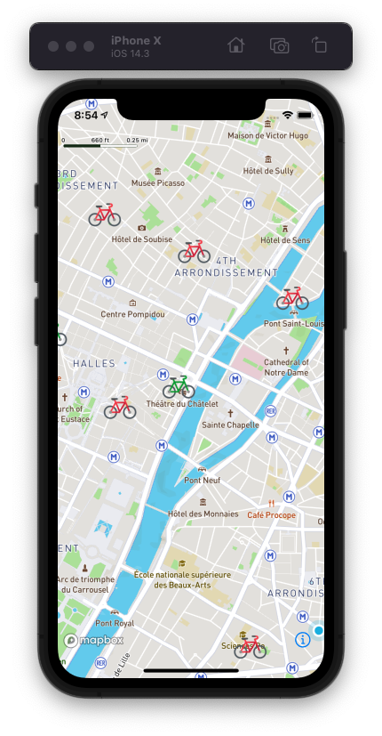
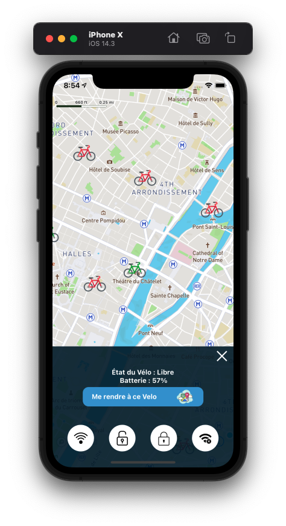
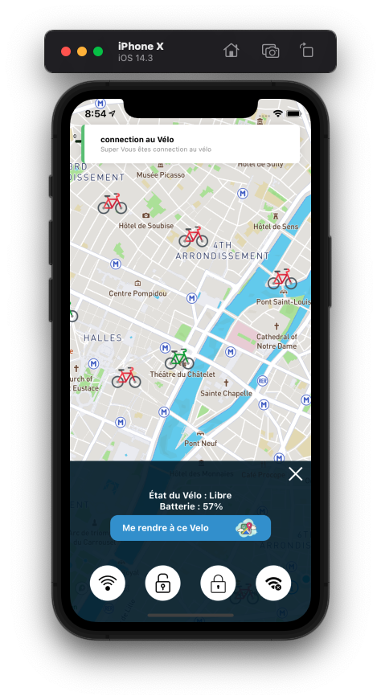

<h1 align="center">APP mobile React Native Tech</h1>

 

## Présentation du rendu

- [x] Affichage de Mapbox
- [x] Affichage de la localisation de l'utilisateur
- [x] Affichage colorés des Velos en fonction de leurs disponibilité ( Rouge :indisponible | Vert : Disponible )
- [x] Info Suppplémentaire d'un Velo
- [x] Ajout de variable d'environnement pour sécuriser la clé MapBox
- [ ] Intégration d'un SDK

 

---

 

## ScreenShot de l'app

## Design Atomique

L'entrée des Vues de L'applications se constitue toujours de la même façon

- Les Screens ( donnée de Navigation de l'application )
- Les Containers ( La Logique | appel API )
- Les Organisms ( La Vue | Formulaire... )
- Les Molécules & Atoms (Element répétitif: boutton,icon, input, Titre )
- Les Views (Sous-Partie pour alléger l'organisme _qui ne se repetes pas_ )

 

---

 

## .env

Afin de faire fonctionné correctement le projet vous aurez besoin de quelques clé necéssaire

|        Key         |   Description    |
| :----------------: | :--------------: |
| MAPBOX_PRIVATE_KEY | Clé privé Mapbox |

 

### Commande à savoir

<kbd>npm i</kbd> or <kbd> yarn install</kbd> - Install Dependencies

<kbd> yarn IOS</kbd> - Run the App on IOS
<kbd> yarn Android</kbd> - Run the App on Android

- En savoir plus sur :
- [React-Native](https://reactnative.dev/)

ENJOY 🙂

## Team

- Développé par [Jeremy Noh](https://github.com/JeremyNoh)

 

Merci à vous 🤗
